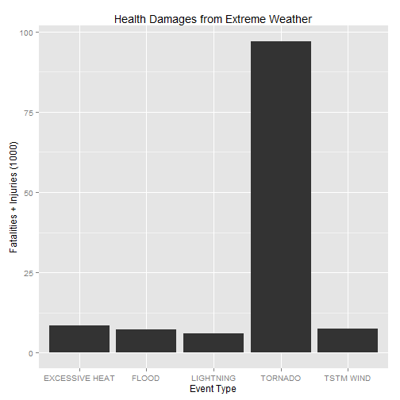

Analysis of economic and health damages caused by storms and other severe weather events
========================================================

Storms and other severe weather events can cause both public health and economic problems for communities and municipalities. Many severe events can result in fatalities, injuries, and property damage, and preventing such outcomes to the extent possible is a key concern.

This project involves exploring the U.S. National Oceanic and Atmospheric Administration's (NOAA) storm database. This database tracks characteristics of major storms and weather events in the United States, including when and where they occur, as well as estimates of any fatalities, injuries, and property damage.

In this study, we try to show that flood causes major economic problems, up to hundred of billions dollars since the beginning of this study.
As for public health, tornados are one of extreme events which cause most of fatalities and injuries.

## Data Processing

```r
setwd("C:/Users/HomeUser/Documents/Spécialité Data Science/Reproducible Research/repos/WeatherDamages")
```


### Data Loading

```r
rawdata <- read.csv("../../data/repdata_data_StormData.csv.bz2", header = T, 
    sep = ",", na.strings = "?", comment.char = "")
print(object.size(rawdata), unit = "Mb")
```

```
## 409.4 Mb
```


### Narrowing to most relevant informations


#### Get quick informations on variables

```r
str(rawdata)
```

```
## 'data.frame':	902297 obs. of  37 variables:
##  $ STATE__   : num  1 1 1 1 1 1 1 1 1 1 ...
##  $ BGN_DATE  : Factor w/ 16335 levels "1/1/1966 0:00:00",..: 6523 6523 4242 11116 2224 2224 2260 383 3980 3980 ...
##  $ BGN_TIME  : Factor w/ 3608 levels "00:00:00 AM",..: 272 287 2705 1683 2584 3186 242 1683 3186 3186 ...
##  $ TIME_ZONE : Factor w/ 22 levels "ADT","AKS","AST",..: 7 7 7 7 7 7 7 7 7 7 ...
##  $ COUNTY    : num  97 3 57 89 43 77 9 123 125 57 ...
##  $ COUNTYNAME: Factor w/ 29601 levels "","5NM E OF MACKINAC BRIDGE TO PRESQUE ISLE LT MI",..: 13513 1873 4598 10592 4372 10094 1973 23873 24418 4598 ...
##  $ STATE     : Factor w/ 72 levels "AK","AL","AM",..: 2 2 2 2 2 2 2 2 2 2 ...
##  $ EVTYPE    : Factor w/ 984 levels "   HIGH SURF ADVISORY",..: 833 833 833 833 833 833 833 833 833 833 ...
##  $ BGN_RANGE : num  0 0 0 0 0 0 0 0 0 0 ...
##  $ BGN_AZI   : Factor w/ 35 levels "","  N"," NW",..: 1 1 1 1 1 1 1 1 1 1 ...
##  $ BGN_LOCATI: Factor w/ 54428 levels "","- 1 N Albion",..: 1 1 1 1 1 1 1 1 1 1 ...
##  $ END_DATE  : Factor w/ 6663 levels "","1/1/1993 0:00:00",..: 1 1 1 1 1 1 1 1 1 1 ...
##  $ END_TIME  : Factor w/ 3646 levels ""," 0900CST",..: 1 1 1 1 1 1 1 1 1 1 ...
##  $ COUNTY_END: num  0 0 0 0 0 0 0 0 0 0 ...
##  $ COUNTYENDN: logi  NA NA NA NA NA NA ...
##  $ END_RANGE : num  0 0 0 0 0 0 0 0 0 0 ...
##  $ END_AZI   : Factor w/ 24 levels "","E","ENE","ESE",..: 1 1 1 1 1 1 1 1 1 1 ...
##  $ END_LOCATI: Factor w/ 34506 levels "","- .5 NNW",..: 1 1 1 1 1 1 1 1 1 1 ...
##  $ LENGTH    : num  14 2 0.1 0 0 1.5 1.5 0 3.3 2.3 ...
##  $ WIDTH     : num  100 150 123 100 150 177 33 33 100 100 ...
##  $ F         : int  3 2 2 2 2 2 2 1 3 3 ...
##  $ MAG       : num  0 0 0 0 0 0 0 0 0 0 ...
##  $ FATALITIES: num  0 0 0 0 0 0 0 0 1 0 ...
##  $ INJURIES  : num  15 0 2 2 2 6 1 0 14 0 ...
##  $ PROPDMG   : num  25 2.5 25 2.5 2.5 2.5 2.5 2.5 25 25 ...
##  $ PROPDMGEXP: Factor w/ 18 levels "","-","+","0",..: 16 16 16 16 16 16 16 16 16 16 ...
##  $ CROPDMG   : num  0 0 0 0 0 0 0 0 0 0 ...
##  $ CROPDMGEXP: Factor w/ 8 levels "","0","2","B",..: 1 1 1 1 1 1 1 1 1 1 ...
##  $ WFO       : Factor w/ 542 levels ""," CI","$AC",..: 1 1 1 1 1 1 1 1 1 1 ...
##  $ STATEOFFIC: Factor w/ 250 levels "","ALABAMA, Central",..: 1 1 1 1 1 1 1 1 1 1 ...
##  $ ZONENAMES : Factor w/ 25112 levels "","                                                                                                                               "| __truncated__,..: 1 1 1 1 1 1 1 1 1 1 ...
##  $ LATITUDE  : num  3040 3042 3340 3458 3412 ...
##  $ LONGITUDE : num  8812 8755 8742 8626 8642 ...
##  $ LATITUDE_E: num  3051 0 0 0 0 ...
##  $ LONGITUDE_: num  8806 0 0 0 0 ...
##  $ REMARKS   : Factor w/ 436781 levels "","-2 at Deer Park\n",..: 1 1 1 1 1 1 1 1 1 1 ...
##  $ REFNUM    : num  1 2 3 4 5 6 7 8 9 10 ...
```

#### Get deeper information on relevant numeric variables

```r
summary(rawdata[, c("PROPDMG", "CROPDMG")])
```

```
##     PROPDMG        CROPDMG     
##  Min.   :   0   Min.   :  0.0  
##  1st Qu.:   0   1st Qu.:  0.0  
##  Median :   0   Median :  0.0  
##  Mean   :  12   Mean   :  1.5  
##  3rd Qu.:   0   3rd Qu.:  0.0  
##  Max.   :5000   Max.   :990.0
```

#### Get deeper information on relevant ordinal variables

```r
unique(rawdata$PROPDMGEXP)
```

```
##  [1] K    M         B    m    +    0    5    6    <NA> 4    2    3    h   
## [15] 7    H    -    1    8   
## Levels:  - + 0 1 2 3 4 5 6 7 8 B h H K m M
```

```r
unique(rawdata$CROPDMGEXP)
```

```
## [1]      M    K    m    B    <NA> 0    k    2   
## Levels:  0 2 B k K m M
```

#### Get deeper information on relevant categorical variables

```r
length(unique(rawdata$EVTYPE))
```

```
## [1] 985
```

```r
head(sort(unique(rawdata$EVTYPE)), 50)
```

```
##  [1]    HIGH SURF ADVISORY           COASTAL FLOOD                
##  [3]  FLASH FLOOD                    LIGHTNING                    
##  [5]  TSTM WIND                      TSTM WIND (G45)              
##  [7]  WATERSPOUT                     WIND                         
##  [9] ABNORMAL WARMTH                ABNORMALLY DRY                
## [11] ABNORMALLY WET                 ACCUMULATED SNOWFALL          
## [13] AGRICULTURAL FREEZE            APACHE COUNTY                 
## [15] ASTRONOMICAL HIGH TIDE         ASTRONOMICAL LOW TIDE         
## [17] AVALANCE                       AVALANCHE                     
## [19] BEACH EROSIN                   Beach Erosion                 
## [21] BEACH EROSION                  BEACH EROSION/COASTAL FLOOD   
## [23] BEACH FLOOD                    BELOW NORMAL PRECIPITATION    
## [25] BITTER WIND CHILL              BITTER WIND CHILL TEMPERATURES
## [27] Black Ice                      BLACK ICE                     
## [29] BLIZZARD                       BLIZZARD AND EXTREME WIND CHIL
## [31] BLIZZARD AND HEAVY SNOW        Blizzard Summary              
## [33] BLIZZARD WEATHER               BLIZZARD/FREEZING RAIN        
## [35] BLIZZARD/HEAVY SNOW            BLIZZARD/HIGH WIND            
## [37] BLIZZARD/WINTER STORM          BLOW-OUT TIDE                 
## [39] BLOW-OUT TIDES                 BLOWING DUST                  
## [41] blowing snow                   Blowing Snow                  
## [43] BLOWING SNOW                   BLOWING SNOW- EXTREME WIND CHI
## [45] BLOWING SNOW & EXTREME WIND CH BLOWING SNOW/EXTREME WIND CHIL
## [47] BREAKUP FLOODING               BRUSH FIRE                    
## [49] BRUSH FIRES                    COASTAL  FLOODING/EROSION     
## 984 Levels:    HIGH SURF ADVISORY  COASTAL FLOOD ... WND
```

-> ToDo: We should group similar categorical variables!
Hierarchical clustering based on distance and time proximity?
Keywords?
#### Get deeper information on other potential relevant variables

```r
head(unique(rawdata$REMARKS), 3)
```

```
## [1]                                                                                                                                                                                                                                                                                                                                                                                                                                                                                                                                                                                                                                                                                                                                                                                                                                                                                                                                                            
## [2] Light freezing rain coated bridges and overpasses across the northern third of Alabama during the early morning.  The icing on bridges and roadways was responsible for a number of traffic accidents.  Icing was apparently not severe enough to bring down trees or power lines.  The death of a 33-year-old man in a single-car accident in Limestone County was attributed to icy road conditions.                                                                                                                                                                                                                                                                                                                                                                                                                                                                                                                                                     
## [3] Light snow fell across the northern third of Alabama, but thanks to relatively warm ground temperatures, little accumulation occurred and travel was not significantly affected.  Snow fell from about 1800 CST on January 22nd to 0300 CST on the 23rd across northwest and north-central Alabama and from 0300 CST to 0800 CST across northeast Alabama.  Heaviest snowfall with amounts of one to two inches were reported in Franklin, Lawrence, and eastern Colbert Counties in the northwest and in Marshall and Jackson Counties in the northeast.  Lauderdale, Limestone, Madison, Marion, Winston, Cullman, Morgan, Blount, Etowah, Dekalb, and northern Cherokee Counties reported varying amounts around an inch.  Lamar, Fayette, Walker, Jefferson, northern Shelby, Talladega, St. Clair, Calhoun, and northern and western Cleburne Counties had snow flurries with spotty locations reporting up to an inch.  Icing on bridges was spotty. 
## 436781 Levels:  -2 at Deer Park\n ... Zones 22 and 23 were added to the high wind warning of  January 26. Peak winds Sitka 55MPH, Cape Decision 58MPH, and Cape Spencer 64MPH.\n
```

#### Let's narrow now

```r
narrowdata <- subset(x = rawdata, subset = FATALITIES > 0 | INJURIES > 0 | PROPDMG > 
    0 | CROPDMG > 0, select = c("STATE", "EVTYPE", "FATALITIES", "INJURIES", 
    "PROPDMG", "CROPDMG", "PROPDMGEXP", "CROPDMGEXP"))
print(object.size(narrowdata), unit = "Mb")
```

```
## 12.7 Mb
```

```r

rm(rawdata)
```

### Data Transformation

```r
cleandata <- narrowdata

cleandata$PROPDMG_estimatedCost <- ifelse(cleandata$PROPDMGEXP %in% c("K", "k"), 
    1000 * cleandata$PROPDMG, ifelse(cleandata$PROPDMGEXP %in% c("M", "m"), 
        1e+06 * cleandata$PROPDMG, ifelse(cleandata$PROPDMGEXP %in% c("B", "b"), 
            1e+09 * cleandata$PROPDMG, ifelse(cleandata$PROPDMGEXP %in% c("H", 
                "h"), 100 * cleandata$PROPDMG, cleandata$PROPDMG))))

cleandata$CROPDMG_estimatedCost <- ifelse(cleandata$CROPDMGEXP %in% c("K", "k"), 
    1000 * cleandata$CROPDMG, ifelse(cleandata$CROPDMGEXP %in% c("M", "m"), 
        1e+06 * cleandata$CROPDMG, ifelse(cleandata$CROPDMGEXP %in% c("B", "b"), 
            1e+09 * cleandata$CROPDMG, ifelse(cleandata$CROPDMGEXP %in% c("H", 
                "h"), 100 * cleandata$CROPDMG, cleandata$CROPDMG))))

cleandata$TotalCostDamages <- cleandata$PROPDMG_estimatedCost + cleandata$CROPDMG_estimatedCost

cleandata$TotalHealthEvents <- cleandata$FATALITIES + cleandata$INJURIES
```


## Results

```r
library(plyr)
library(ggplot2)

TotalCostDamages <- aggregate(TotalCostDamages ~ EVTYPE, data = cleandata, sum)
PROPDMG_estimatedCost <- aggregate(PROPDMG_estimatedCost ~ EVTYPE, data = cleandata, 
    sum)
CROPDMG_estimatedCost <- aggregate(CROPDMG_estimatedCost ~ EVTYPE, data = cleandata, 
    sum)
CostDamages <- join(TotalCostDamages, PROPDMG_estimatedCost, by = "EVTYPE")
CostDamages <- join(CostDamages, CROPDMG_estimatedCost, by = "EVTYPE")

CostDamages$check = CostDamages$TotalCostDamages - CostDamages$PROPDMG_estimatedCost - 
    CostDamages$CROPDMG_estimatedCost
CostDamages <- CostDamages[order(-CostDamages[, "TotalCostDamages"]), ]

sum(CostDamages$check) < 0.001
```

```
## [1] TRUE
```

```r

qplot(EVTYPE, TotalCostDamages/1e+09, data = CostDamages[1:5, ], geom = "bar", 
    stat = "identity", xlab = "Event Type", ylab = "Total Cost (Billions $)", 
    main = "Cost Damages from Extreme Weather")
```

 

```r


TotalHealthEvents <- aggregate(TotalHealthEvents ~ EVTYPE, data = cleandata, 
    sum)
TotalHealthEvents <- TotalHealthEvents[order(-TotalHealthEvents[, "TotalHealthEvents"]), 
    ]

qplot(EVTYPE, TotalHealthEvents/1000, data = TotalHealthEvents[1:5, ], geom = "bar", 
    stat = "identity", xlab = "Event Type", ylab = "Fatalities + Injuries (1000)", 
    main = "Health Damages from Extreme Weather")
```

 

